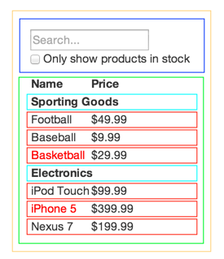

我们认为React是以JavaScript构建大型，高效的Web应用的首要方法。在Facebook和Instagram上的表现很好。

React的优点之一是可以让你在构建App的时候产生思考。而这篇教程将会通过一个可检索的产品列表为你解释React的核心思想。

### Start With Mock

假设现在你有一个JSON API，和如下一个设计图：


JSON API 返回的数据是这样的：
```
[
{category: "Sporting Goods", price: "$49.99", stocked: true, name: "Football"},
{category: "Sporting Goods", price: "$9.99", stocked: true, name: "Baseball"},
{category: "Sporting Goods", price: "$29.99", stocked: false, name: "Basketball"},
{category: "Electronics", price: "$99.99", stocked: true, name: "iPod Touch"},
{category: "Electronics", price: "$399.99", stocked: false, name: "iPhone 5"},
{category: "Electronics", price: "$199.99", stocked: true, name: "Nexus 7"}
];
```

### 第一步：将UI拆解为具有层级关系的组件

首先你要做的是在设计图上划分每个组件以及它的子组件，并且给他们起个名字。如果你和设计师一起工作的话，他们理论上是会为你做好这件事的。
他们的Photoshop layer names就可以作为你组建的名字。

但是你要如何判断它是否应该成为一个独立的组件呢？这和你判断是否需要新建一个function或者是object一样。一个技巧是：单一责任化原则，也就是说一个组件只负责做一件事是最理想的。如果组件的功能因为改版而变得更加复杂的时候，我们应该重新解构，将其分解成多个子组件。

我们经常性地需要展现JSON格式的数据给用户，你会发现如果你的数据格式正确，就会很好的Map出来UI（即组件结构）。这是因为数据格式和UI都
与信息结构紧密相关的，也就意味着将UI分离成组件的过程非常简单：只要拆成一个个只展示单一数据的组件就好了。



从上图中可以看到我们将App分成五个组件。组件结构与数据划分如下：

1. FilterableProductTable(可筛选产品表格)（橘色框）：包含整个示例结构。

2. SearchBar(搜索框)（蓝色框）：接收所有用户键入数据。

3. ProductTable(产品表格)（绿色框）：展示根据用户输入而过滤出的数据。

4. ProductCategoryRow(产品类别行)（蓝绿色）：展示类别名。

5. ProductRow(产品行)（红色框）：展示产品名。

看一下这个ProductTable，表格的头部（包含"Name"和"Price"标签的这部分）没有组件化（独立成组件），这是个人倾向的选择，谁说都有理，
在这个案例中，我们就让它作为ProductTable的一部分吧，因为"Name"和"Price"也是ProductTable要展现的数据的一部分。不过，当这个头部信息
越来越复杂的时候（比如我们要加上一个新的筛选条件,比如[affordances][]），将它独立出来作为一个ProductTableHeader就非常合理了。

现在我们已经划分好了组件，可以开始安排层级关系了。这也是很简单的，出现在组件内部的组件就是层级关系中的子元素啦。

    FilterableProductTable
        SearchBar
        ProductTable
            ProductCategoryRow
            ProductRow

### 第二步：构建静态的React


现在我们确定了组件的层级关系，可以开始实现了。最简单的方式是，先写一个静态的无交互，只展示数据的版本。因为静态版本需要打很多字不用
太多思考（体力活），而加入交互更多的是脑力活动。所以分开来做比较好。

创建一个展示数据的静态版本应用，你应该尽量复用其他组件并且通过props来传递数据。props是一种从父级向子组件传递数据的方式。如果你现在
已经了解了state，在开发静态版本时请不要使用。state只用在交互中，即 会随着时间而改变的数据。

你既可以自上而下，也可以自下而上开发，从最高层级（FilterableProductTable），或者是从最低层级（ProductRow）开始。结构简单的App，
往往是自上而下的。复杂的项目中，我们最好自下而上并且边写边测。

这步结束后，你会有一个可复用的组件库来渲染你的数据结构。由于现在写是静态的版本，所以组件内只有 `render()` 方法。最上层组件（FilterableProductTable）会将数据放在props里。基础数据改变并再次调用 `ReactDOM.render()` ,UI会更新。因为React的单项数据流使一切模块化，观测数据的改变和UI的更新会很容易。

参考[React docs][]。

#### 简单看一下 Props VS State

React有两种数据的形式：props和state。必须要理解它们的区别，如果有疑问，请参考：[the official React docs][]。

### 第三步：确定最少（但完整）的state

如果想要产生交互，你需要触发对基础数据的改变的能力。React的state使一切变得简单。


